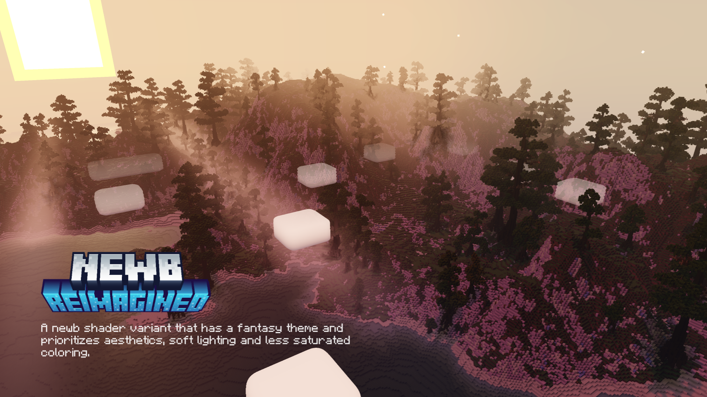

# Newb Reimagined

**Newb Reimagined** is a shader for Minecraft Bedrock, based on [Newb X Legacy](https://github.com/devendrn/newb-x-mcbe) with features like better clouds, clear water, and more colorful auroras! 

This shader prioritizes aesthetics, soft lighting, and less saturated color. Inspired by Complementary Reimagined Shader for Minecraft Java.
It supports Minecraft Bedrock 1.21.20+ (Windows & Android).

> [!WARNING]
> This is an experimental repository made by alyowv, breaking changes are made often.

 

 

## Downloads
[Latest Version](https://github.com/alyow/newb-reimagined/releases)

Beta version can be found on our discord server

 

## Installation

> [!NOTE]
> Shaders are not officially supported on Minecraft Bedrock. The following are unofficial ways to load shaders.

### Android
1. Install [MB Loader App](https://devendrn.github.io/renderdragon-shaders/shaders/installation/android#using-patch-app)
2. Import the resource pack and activate it in global resources.

### Windows
1. Use [BetterRenderDragon](https://github.com/QYCottage/BetterRenderDragon) to enable MaterialBinLoader.
2. Import the resource pack and activate it in global resources.
3. If BetterRenderDragon not working on your device use [Matject](https://faizul726.github.io/matject/) instead.

 

## License

**Source Code:** The "Newb Shader" source code is licensed under the MIT License. You are free to modify, distribute, and create derivative works based on the source code.

**Compiled Resource Packs (`.mcpack` files):** The compiled resource packs distributed by the "Newb Shader" project and its variant creators are copyrighted works with restrictions. See the `COPYRIGHT.txt` file within each resource pack for more information.

